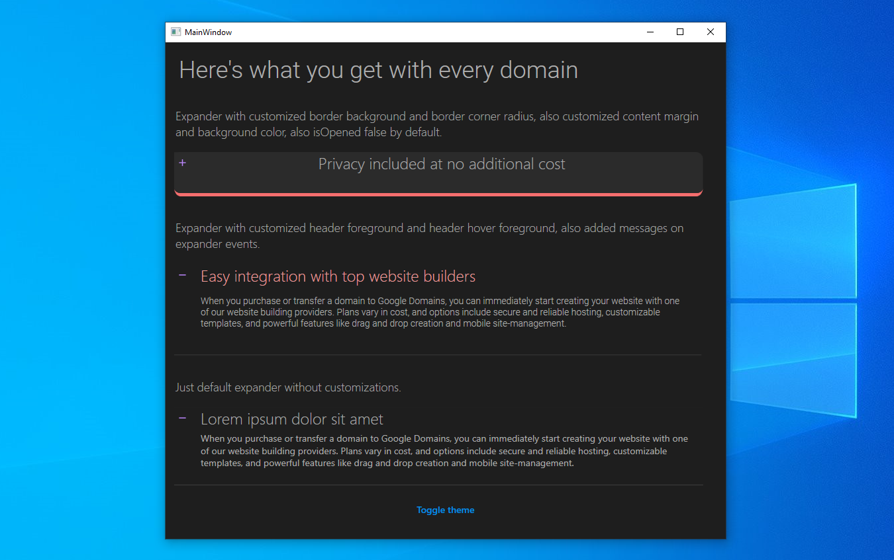
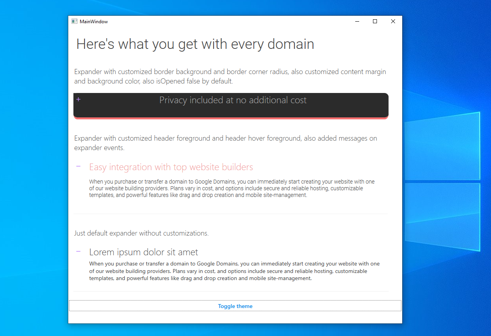

# MaterialDesign-WPF-Expander
#### Just expander designed with using material design.

```
This is my first custom WPF control library. These are preliminary
versions and the library was experimental before the 0.5.0 version.
Perhaps there are some problems, if you notice them please report them.
```
---
```
The idea of creating this Expander ui element came up with when I
visited https://domains.google/#/domains-features, there I saw
this element and I just had an idea to try to implement this element
in WPF. It turned out not bad, I think.
```

#### Get it (nuget):
```
Install-Package aterialDesign-WPF-Expander
```

#### Here are some screenshots of the demo project:




```
This element also supports basic customization, background color,
foreground color, hover foreground color, font styling and in
general you can simply override the files with themes.
```

#### Quick start:

##### App.xaml:

```xml
<Application>
    <Application.Resources>
        <ResourceDictionary>
            <ResourceDictionary.MergedDictionaries>
                <ResourceDictionary Source="pack://application:,,,/MaterialDesign-WPF-Expander;component/Resources/Icons/Icons.xaml" />
                <!--  For using by default light theme just replace DarkDictionary.xaml on LightDictionary.xaml  -->
                <ResourceDictionary Source="pack://application:,,,/MaterialDesign-WPF-Expander;component/Themes/DarkDictionary.xaml" />
            </ResourceDictionary.MergedDictionaries>
        </ResourceDictionary>
    </Application.Resources>
</Application>
```

##### MainWindow.xaml:

```xml
<mdex:Expander
    Title="Lorem ipsum dolor sit amet"
    Background="{DynamicResource Ex-Background-Brush}"
    BorderBrush="{DynamicResource Ex-BorderFill-Brush}"
    Foreground="{DynamicResource Ex-HeaderForeground-Brush}"
    HoverForeground="{DynamicResource Ex-HeaderHoverForeground-Brush}"
    IsOpened="True">
        <TextBlock
            Padding="40,5,5,0"
            FontSize="14"
            Foreground="{DynamicResource Ex-HeaderForeground-Brush}"
            TextWrapping="WrapWithOverflow">
            Some text for expander
        </TextBlock>
</mdex:Expander>
```